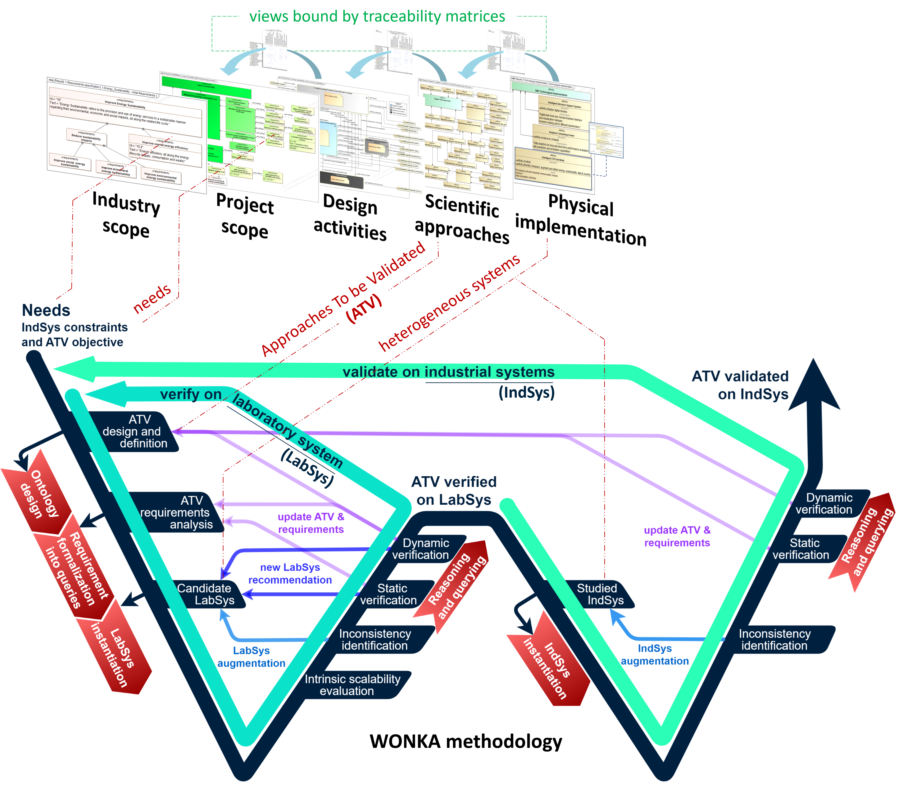

# Verification and Validation with an ONtology and Knowledge-based Approach (WONKA)

This is an implementation of the WONKA methodology using `Owlready2` and `rdflib` libraries, as described in our paper:

Delabeye, R., Penas, O., & Plateaux, R. (2022, October). [Scalable ontology-based V&V process for heterogeneous systems and applications](https://hal.science/hal-03912273/document). In Proceedings of the 25th International Conference on Model Driven Engineering Languages and Systems: Companion Proceedings (pp. 341-350).



A more detailed description of the case study is presented in the [S.mart benchmark repository](https://github.com/GIS-S-mart), where a dedicated benchmark on [Early Verification and Validation](https://github.com/GIS-S-mart/Benchmark-1_MBSE_for_Early_Validation_and_Verification) is presented.

## Installation

```bash
conda env create -f environment.yml
pip install -e .
```

## Requirements
* Owlready2 (> 0.41)
* rdflib
* networkx
* pandas

## Run the demo

```bash
cd case_study
python main_MODELS2022.py
```

## Data

You can apply the WONKA methodology on your own data using this implementation, therefore you need to provide the following:
* an instantiated ontology (.owl file)
* a set of requirements, translated as SPARQL queries (.rq files)

The ontology should be instantiated according to the blueprint presented in the paper (from the scientific approach to be validated, to the targeted use cases). For some of the features, it is also necessary to provide the edges to remove in order to separate the sub-knowledge graphs (associated to each use case).

## Cite

Please consider citing our paper if you use this code or methodology in your work:

```
@inproceedings{delabeye2022scalable,
  title={Scalable ontology-based V\&V process for heterogeneous systems and applications},
  author={Delabeye, Romain and Penas, Olivia and Plateaux, R{\'e}gis},
  booktitle={Proceedings of the 25th International Conference on Model Driven Engineering Languages and Systems: Companion Proceedings},
  pages={341--350},
  year={2022}
}
```
